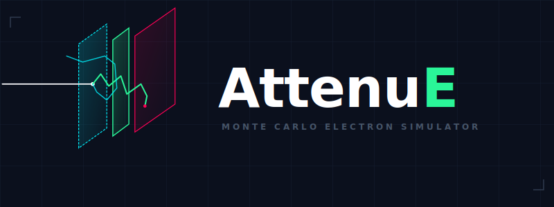

# AttenuE



AttenuE is a cloud-native, high-performance Monte Carlo simulation utility designed to track charged particle interactions through multi-layer material and heterojunction device stacks. 

Unlike X-ray photons, which travel linearly until sudden deterministic attenuation (modeled in our sister app, **AttenuX**), electrons experience continuous inelastic energy loss and frequent elastic deflections due to Coulomb forces. AttenuE runs highly parallelized vector operations to simulate these random walks step-by-step, providing immediate structural insights for semiconductor prototyping, electron-beam lithography, and radiation dose mapping.

---

## 🚀 Core Features

* **Layer Stack Designer**: Build, organize, and tweak complex multi-layer heterojunction targets dynamically with responsive element deletion.
* **Vectorized Monte Carlo Trajectories**: Simulates up to 500 individual electron tracks simultaneously using high-speed numerical sampling.
* **Visualized Interaction Volumes**: Generates the iconic 2D "pear-shaped" electron scattering distribution profiles, cleanly rendering backscattered ($\eta$), absorbed, and transmitted pathways.
* **Depth-Dose Profile Spectrum**: Computes a continuous energy-dissipation curve across structural boundaries to locate peak internal lattice ionization (Bragg-like peaks).
* **Research-Grade Data Exporter**: Instantly compile and export full telemetry tracking vectors and dose spectrums directly into standalone `.CSV` files.

---

## 📐 The Physics Engine & Governing Equations

At each discrete spatial step ($dx$), the simulator tracks two primary physical transformations using the **Continuous Slowing-Down Approximation (CSDA)** and screened elastic scattering metrics.

### 1. Inelastic Scattering (Continuous Energy Loss)
As the electron plows through a material layer, it continuously transfers kinetic energy to target shell electrons. This stopping power profile is governed by the **Bethe Equation**:

$$-\frac{dE}{dx} = \frac{2\pi e^4 n Z_{\text{eff}}}{E} \ln\left(\frac{1.166 E}{I}\right)$$

Where:
* $E$ is the instantaneous kinetic energy of the electron ($\text{keV}$).
* $n$ is the atomic number density of the current active layer.
* $Z_{\text{eff}}$ is the effective atomic number of the material target.
* $I$ is the **Mean Excitation Potential** ($\text{eV}$), an empirical representation of atomic core shell ionization limits unique to each material compound.

### 2. Elastic Scattering (Spatial Deflection)
When passing near a positively charged atomic nucleus, the electron undergoes a spatial deflection angle ($\theta$) without changing its kinetic energy velocity. To determine the probability distribution of these bounces, a screened **Rutherford/Mott Differential Cross Section (DCS)** is solved:

$$\frac{d\sigma}{d\Omega} = \frac{Z^2 e^4}{4 E^2 (1 - \cos\theta + 2\alpha)^2}$$

Where $\alpha$ represents the screening factor used to correct for atomic electron cloud shielding, preventing mathematical infinity during zero-angle interactions:

$$\alpha = 3.4 \times 10^{-3} \cdot \frac{Z^{0.67}}{E}$$

During every step loop, uniform random numbers ($r_1, r_2 \in [0,1]$) are sampled to determine the precise deflection angles ($\theta, \phi$) via analytical inversion:

$$\cos\theta = 1 - \frac{2\alpha r_1}{1 + \alpha - r_1}$$

$$\phi = 2\pi r_2$$

---

## 🛠️ Project Architecture

The application is completely modularized to allow for painless material additions and code maintainability:

```text
├── .streamlit/
│   └── config.toml          # Enforces dark mode styling and telemetry palette parameters
├── app.py                   # Main Streamlit frontend UI grid, tabs, and plotting matrix
├── materials.py             # Centralized database registry holding Z, A, density, and I metrics
├── physics_engine.py       # Monte Carlo vector routing engine and math solvers
└── requirements.txt       # Required Python modules required to run the app
